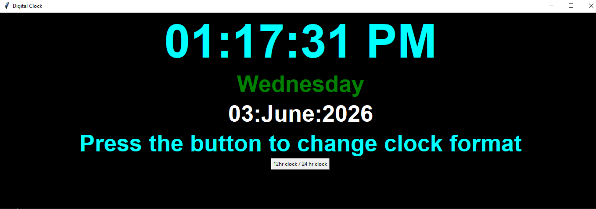

# Python GUI Projects 🖥️

This repository contains GUI-based Python projects built using Tkinter.

## Projects Included
- 🕒 Digital Clock

## Features
- Graphical user interface
- 12-hour and 24-hour clock modes
- Live date and day display
- Real-time updates

## Technologies Used
- Python
- Tkinter
- Datetime module

## About
These projects were created while learning GUI development in Python.
